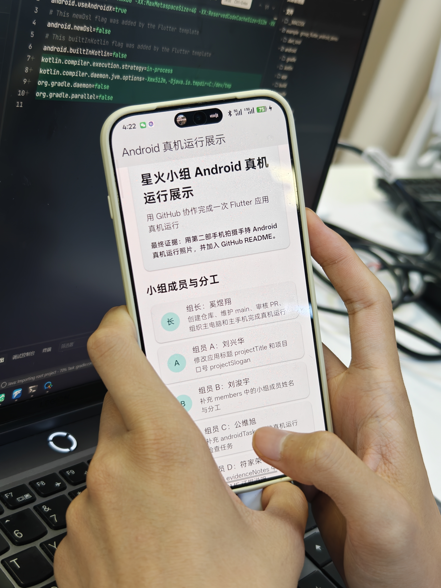
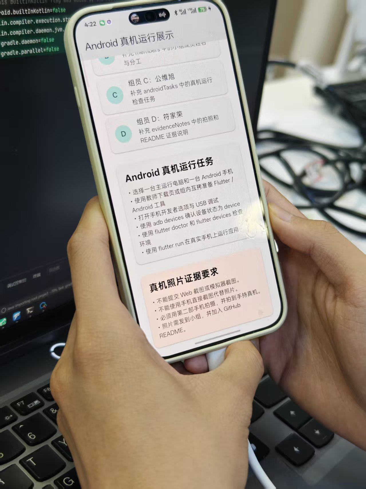
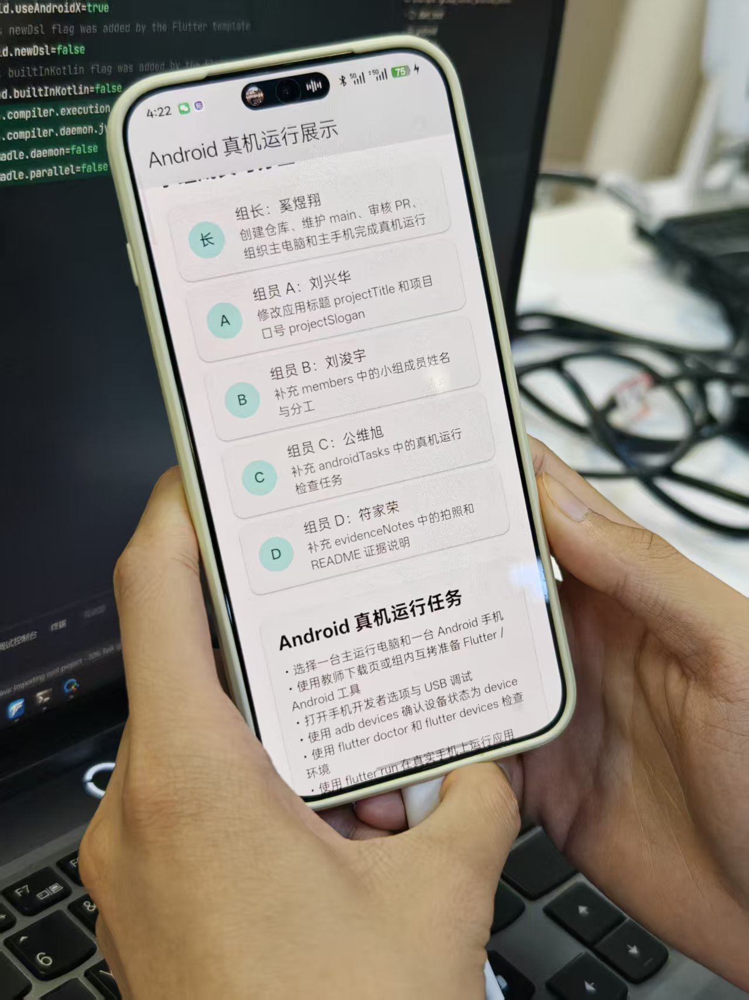

# 小组 Flutter Android 真机运行展示项目

本项目用于第15周 GitHub 小组协作与 Flutter Android 真机运行练习。

本案例只使用一种协作方式：**组长创建原始仓库，组员 Fork 后提交 Pull Request，组长审核并合并**。组员不直接 push 组长仓库的 `main` 分支，也不要求组长把组员加入 collaborator。

本项目不是为了比拼复杂功能，而是一个“小组协作成果展示应用”。每名组员只需要修改一个区域，目标是留下 GitHub 协作痕迹，并让最终成果在真实 Android 手机运行。

## 项目目标

小组需要完成：

1. 组长创建 GitHub 原始仓库并上传本项目。
2. 组员 Fork 组长仓库。
3. 每名组员在自己的 Fork 中创建分支并修改指定内容。
4. 组员通过 Pull Request 请求合并。
5. 组长审核并合并 PR。
6. 小组选出一台主电脑和一台 Android 手机。
7. 在真实 Android 手机上运行 Flutter 应用。
8. 用第二部手机拍摄手持真机运行照片。
9. 把照片发到小组，并加入本 README。

## 课堂下载与环境准备

课堂下载页：

```text
http://10.50.2.92/course-mobile-week15/
```

下载页提供 Android Studio、Flutter SDK、Android Platform-Tools、Android Command-line Tools 和 `checksums.sha256`。课堂优先保障一台主电脑跑通。如果下载速度较慢，可以组内或组间使用 U 盘、移动硬盘或局域网共享互相拷贝。拷贝后仍必须在本机运行检查命令。

## 运行前避坑清单

开始运行前先检查：

-路径要求：Flutter SDK、项目文件夹均使用纯英文短路径，示例：C:\dev\flutter、C:\dev\group_flutter_android_demo，禁止存放于含中文、空格、特殊符号的目录中。
-Git 认证：GitHub 已禁用账号密码直接推送，若执行 git push 出现 password authentication removed 提示，请使用 GitHub Desktop、Git 凭据管理器或 GitHub 个人访问令牌完成认证。
-仓库创建：组长新建 GitHub 原始仓库时，选择创建空仓库，不要勾选 README、.gitignore、License 等选项，防止代码合并冲突。
-手机连接：手机连接电脑后，USB 模式设置为文件传输（MTP），手动开启开发者选项与 USB 调试，并授权信任当前电脑。
-首次编译：首次运行 flutter run 卡在 Running Gradle task 'assembleDebug' 为正常依赖下载过程，由主电脑优先完成首次构建，全员不要同步重复操作。
-图片与文档：真机实拍照片压缩至 2MB–5MB；在 README.md 中引用图片时，路径、文件名大小写必须完全匹配，避免图片加载失败。

## 运行要求

进入项目根目录后执行：

```bash
flutter pub get
flutter test
flutter run
```

如果有多台设备，先查看设备：

```bash
flutter devices
```

再指定 Android 设备运行：

```bash
flutter run -d 设备ID
```

## Android 真机连接检查

连接 Android 手机后，建议先检查：

```bash
adb devices
flutter devices
```

`adb devices` 中设备状态必须是：

```text
device
```

如果是 `unauthorized`，请解锁手机并点击允许 USB 调试。

## 小组分工

| 角色 | 修改位置 | 任务 |
| --- | --- | --- |
| 组长 | GitHub 仓库 | 创建仓库、维护 main、审核 PR、组织真机运行 |
| 组员 liujunyu | `lib/main.dart` | 修改 `projectTitle` 和 `projectSlogan` |
| 组员 B | `lib/main.dart` | 修改 `members` 中的小组成员姓名和分工 |
| 组员 C | `lib/main.dart` | 修改 `androidTasks` 中的真机运行任务 |
| 组员 D | `lib/main.dart` 和 `README.md` | 修改 `evidenceNotes`，补充 README 真机照片说明 |

## Android 真机运行效果

### 真机运行效果展示

本组 Flutter 应用已在真实 Android 手机（PLB110，Android 16，API 36）上成功运行。以下为第二部手机拍摄的真机运行照片：







### 照片说明

- 以上照片均由第二部手机拍摄，并非手机直接截图或 Web 截图。
- 画面中可看到手持的真实 Android 手机正在运行本 Flutter 应用。
- 照片路径：`images/real-device-1.jpg`、`images/real-device-2.jpg`、`images/real-device-3.jpg`。
- 
项目已经完成搭建并且能够运行
